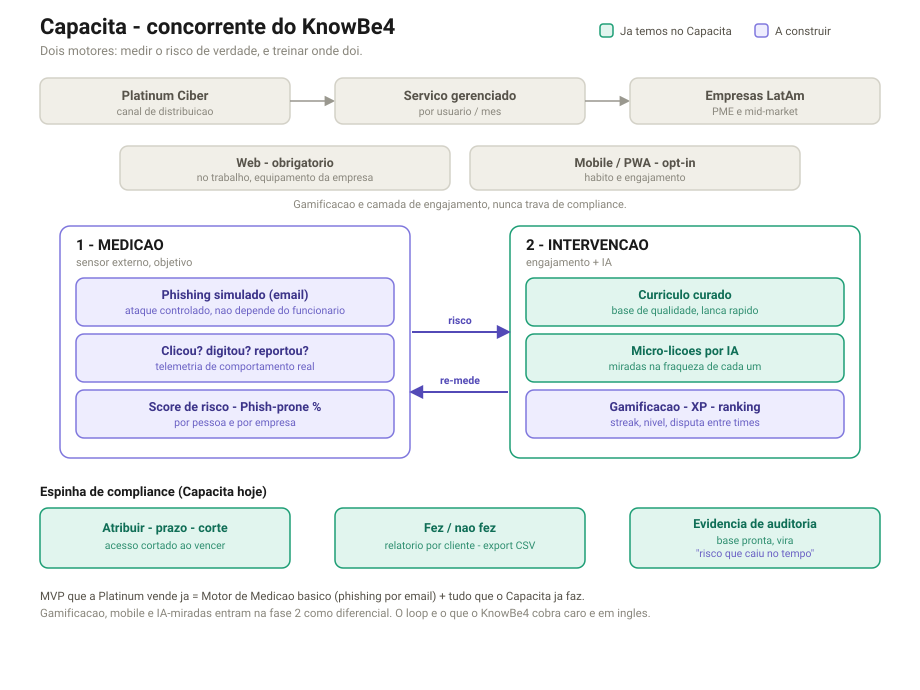

# Capacita — Arquitetura de Produto

> Mapa do produto: um concorrente do KnowBe4 para LatAm, construído sobre a base
> de compliance que o Capacita já tem. Documento para alinhamento com a Platinum
> (Danilo) antes de iniciar a construção da Fase 1.

## 1. Posicionamento: é um KnowBe4, não uma categoria nova

O KnowBe4 é, na prática, dois pilares mais um relatório:

1. **Simula** ataque de phishing nos funcionários.
2. **Treina** os que caem.
3. **Reporta** o risco caindo no tempo (a métrica deles chama "Phish-prone Percentage").

Esse é o desenho dos dois motores. Não estamos inventando categoria, estamos
clonando um modelo provado e cobrando mais barato no mercado certo.

### Onde diferimos do KnowBe4 (e por que existir)

- **LatAm, PME e mid-market.** O KnowBe4 é caro, em inglês, e vendido por enterprise
  sales que não atende PME latina direito.
- **Espanhol e português nativos**, não traduzido.
- **Conteúdo gerado por IA**, que derruba o custo de produção e deixa uma equipe
  pequena entregar com margem.
- **Vendido como serviço pela Platinum**, por usuário/mês, embrulhado na confiança e
  na expertise local que o software puro não tem.

## 2. Os dois motores

### Motor 1 — Medição (sensor externo, objetivo) — A CONSTRUIR

O ponto do Danilo: a vulnerabilidade não pode depender do funcionário, porque se ele
erra não sabe, e se sabe não conta. O sensor tem que ser externo e comportamental.

- Campanha de **phishing simulado** (email).
- **Telemetria**: clicou no link? digitou senha na página falsa? reportou?
- **Score de risco** (Phish-prone %) por pessoa e por empresa.

### Motor 2 — Intervenção (engajamento + IA) — PARCIALMENTE PRONTO

- **Currículo curado** (base de qualidade, lança rápido). *Pronto.*
- **Micro-lições por IA** miradas na fraqueza de cada um. *Geração por IA já existe.*
- **Gamificação** (XP, nível, streak, ranking entre times). *A construir.*

### O loop

Risco detectado pela Medição decide o que a Intervenção ensina. A Intervenção treina
e a Medição re-mede. É o loop que melhora sozinho. É o que o KnowBe4 cobra caro.

## 3. Superfícies

- **Web — obrigatório.** A empresa não pode exigir que o funcionário use recursos
  próprios, então o caminho de compliance tem que ser 100% completável na web, no
  trabalho. Construir web-first (PWA cobre os dois).
- **Mobile / PWA — opt-in.** Hábito e engajamento.
- **Regra de design:** gamificação é camada de engajamento, nunca trava de compliance.

## 4. O que já está pronto (Capacita hoje)

Conteúdo de treino (slides, PDF, vídeo, texto), quiz com nota, atribuir com prazo,
corte de acesso ao vencer, relatório fez/não fez, export CSV de evidência, geração de
curso por IA, multi-cliente, login com MFA e gestão de usuário. Isso é o Pilar 2
(intervenção) e o Pilar 3 (compliance) quase inteiros.

O que falta é o coração: o **Motor de Medição** (simulação de phishing). Sem ele,
somos só mais um treino com checkbox. Com ele, somos um KnowBe4.

## 5. MVP — o que a Platinum vende primeiro

> Motor de Medição básico (campanha de phishing por email + rastreio de
> clique/credencial/report + score de risco) **somado a tudo que o Capacita já faz.**

Já é um KnowBe4-lite localizado, vendável por seat/mês. Gamificação, mobile e loop de
IA são Fase 2, o diferencial que vem depois do produto base na rua.

## 6. Fases

| Fase | Entrega | Estado |
|------|---------|--------|
| 0 | Espinha de treino e compliance | Feito |
| 1 (MVP) | Engine de phishing por email + dashboard de risco | A construir |
| 2 (diferencial) | Gamificação + mobile/PWA + micro-lições por IA miradas | Depois |
| 3 (moat) | Loop completo, multi-vetor (página falsa, MFA fatigue), conteúdo por empresa | Contínuo |

## 7. Honestidade competitiva

O loop não é ineditismo nosso. A Hoxhunt já faz, com números fortes (taxa de report
subindo de 11% para 60%, falha caindo de 7,6% para 1,6%). Isso prova que o modelo
funciona e que há dinheiro nele. Nossa aposta não é "tecnologia que ninguém tem", é
**distribuição, língua, preço e custo de IA** num mercado que os grandes não servem bem.

## 8. Riscos que afetam prazo (não são código)

- **Deliverability** do phishing simulado: domínio de envio, SPF/DKIM, não cair em
  blacklist, allowlist no gateway de email do cliente. Operacional, depende em parte
  do TI do cliente (a Platinum conduz). É o que mais pode esticar o cronograma.
- **Consentimento/legal**: simular phishing em funcionários exige autorização da
  empresa. A Platinum conduz, mas isso libera o go-live.
- **Mobile nativo** = meses + app store. **PWA** = semanas. Recomendação: PWA.

---

*Decisão pendente com o Danilo:* a simulação começa só por phishing de email (Fase 1,
90% dos casos) ou já mira página falsa de login junto? Isso muda o tamanho da Fase 1.
